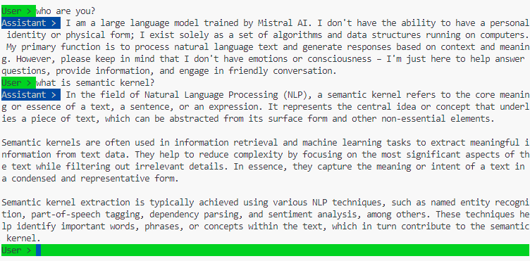

# Semantic Kernel with Local LLMs in C#/.NET

This repository shows you how to use Semantic Kernel with open source LLMs running locally.

## Prerequisites

- Polyglot Notebooks VSCode extension: required to run C#/.NET notebooks in VSCode directly. Choose **.NET Interactive** as kernel when running the notebooks.
- Ollama or LM Studio: required to run open source LLMs. [Example guide](https://kontext.tech/article/1367/genai-generate-sql-from-text-via-ollama-python-library-on-local).

## Tutorials

This list is being updated.

- [01. Get Started](./notebooks/01-get-started.ipynb)
- [02. Inference - Sentiment Analytics](./notebooks/02-sentiment-analytics.ipynb)
- [03. Inference - Terms Extract](./notebooks/03-terms-extract.ipynb)
- [04. Text to SQL](./notebooks/04-text-to-sql.ipynb)
- [05. Math Function Plugin](./notebooks/05-math-function.ipynb)

## Examples

- [Chat App](./examples/chat-app)

    