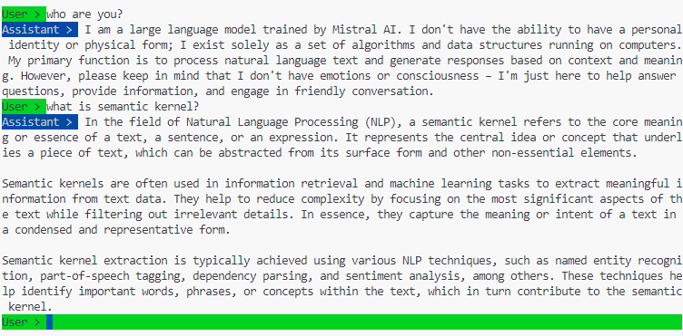

# Chat app example

This project shows you how to create a Chat App with Semantic Kernel with local LLMs running via Ollama.

Run the following command to start the conversation:

```
dotnet run
```

